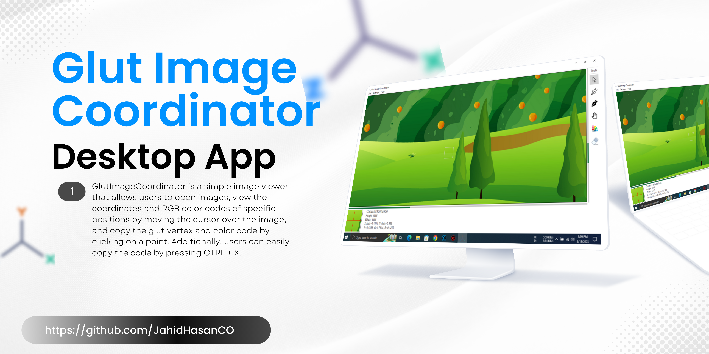

# Glut Image Coordinator
**GlutImageCoordinator** is a simple image viewer  that allows users to open images, view the coordinates and RGB color codes of specific positions by moving the cursor over the image, and copy the glut vertex and color code by clicking on a point. Additionally, users can easily copy the code by pressing CTRL + X.

This project is useful for those who work with images and want a quick way to determine the coordinates and color codes of specific points in an image. The program is built using the OpenGL Utility Toolkit (GLUT) library and supports various image formats such as PNG, JPG, and BMP.

###  Features:
-   Open and view images in various formats
-   Display coordinates and RGB color codes of specific positions by moving the cursor over the image
-   Copy glut vertex and color code by clicking on a point
-   Copy code easily by pressing CTRL + X

### Screenshots
| Main Window | Copy Window |
| ------ | ------ |
|  |  |


### How to Use
```cpp
#include<windows.h>
#include <GL/glut.h>

void display(){
    glClear(GL_COLOR_BUFFER_BIT);
    // write your code here 
    glutSwapBuffers();
}


int main(int argc, char **argv){
    glutInit(&argc, argv);
    glutInitDisplayMode(GLUT_DOUBLE | GLUT_RGB);

    glutInitWindowSize(500, 500);
    glutCreateWindow("Glut Image Coordinator");
    glClearColor(0.502f, 0.502f, 0.702f, 1.0f);
    glMatrixMode(GL_PROJECTION);
    glLoadIdentity();
    gluOrtho2D(0.0f, 1.0f, 0.0f, 1.0f);
    glMatrixMode(GL_MODELVIEW);
    glutDisplayFunc(display);
    glutMainLoop();
    return 0;
}
```
here 

```glutInitWindowSize(500, 500);``` window size is ```500x500px```.

```gluOrtho2D(0.0f, 1.0f, 0.0f, 1.0f);``` for coordinate rang 0-1.
now you can select postion from app and paste here.

### License
```
MIT License

Copyright (c) 2023 Md. Zahidul Islam

Permission is hereby granted, free of charge, to any person obtaining a copy
of this software and associated documentation files (the "Software"), to deal
in the Software without restriction, including without limitation the rights
to use, copy, modify, merge, publish, distribute, sublicense, and/or sell
copies of the Software, and to permit persons to whom the Software is
furnished to do so, subject to the following conditions:

The above copyright notice and this permission notice shall be included in all
copies or substantial portions of the Software.

THE SOFTWARE IS PROVIDED "AS IS", WITHOUT WARRANTY OF ANY KIND, EXPRESS OR
IMPLIED, INCLUDING BUT NOT LIMITED TO THE WARRANTIES OF MERCHANTABILITY,
FITNESS FOR A PARTICULAR PURPOSE AND NONINFRINGEMENT. IN NO EVENT SHALL THE
AUTHORS OR COPYRIGHT HOLDERS BE LIABLE FOR ANY CLAIM, DAMAGES OR OTHER
LIABILITY, WHETHER IN AN ACTION OF CONTRACT, TORT OR OTHERWISE, ARISING FROM,
OUT OF OR IN CONNECTION WITH THE SOFTWARE OR THE USE OR OTHER DEALINGS IN THE
SOFTWARE.
```
### Contributing  💡

If you want to contribute to this project and make it better with new ideas, your pull request is very welcomed. If you find any issue just put it in the repository issue section, thank you.
